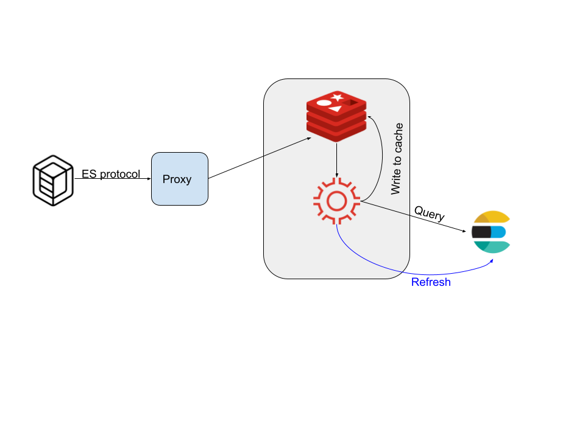

# es-redis

A caching proxy for Elasticsearch query requests using Redis Gears.



This will proxy and fetch search results from an upstream Elasticsearch server and cache.  The gear will then refresh the cache based on a global grace period for a configurable amount of time.


## Building

### Mac/Linux

0) set GOROOT environment variable
1) Install Go and Make
2) make

### Docker

0) set GOROOT environment variable
1) Install Docker, Go and Make
2) make docker


## Running

### Mac/Linux

```
./es-redis
```

### Docker

```
docker pull maguec/es-redis:latest
docker run -i -t -p 8080:8080 maguec/es-redis
```

## Testing

run either the docker container or the raw application binary

```
curl http://localhost:8080/health

#check the proxy
curl --header 'Content-Type: application/json' -X POST http://localhost:8080/instruments/_search -d '{"query": {"match_all": {}}}'  |jq
#check the source
curl --header 'Content-Type: application/json' -X POST http://localhost:9200/instruments/_search -d '{"query": {"match_all": {}}}'  |jq

```

---
Copyright © 2021, Chris Mague
